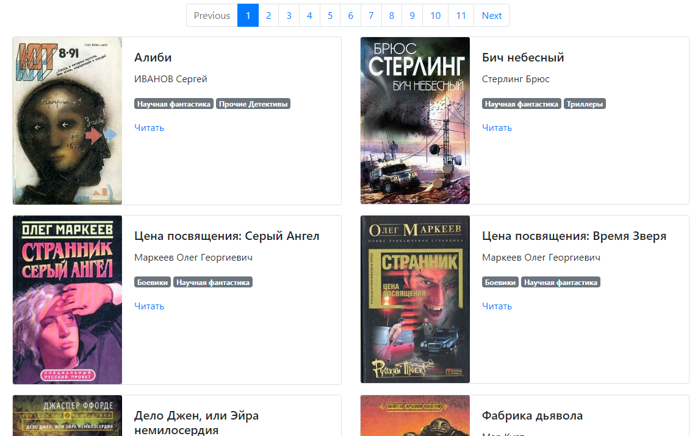
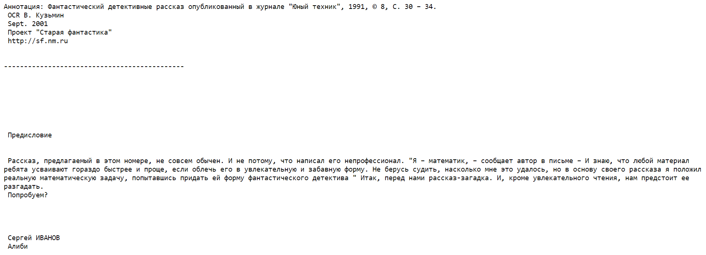
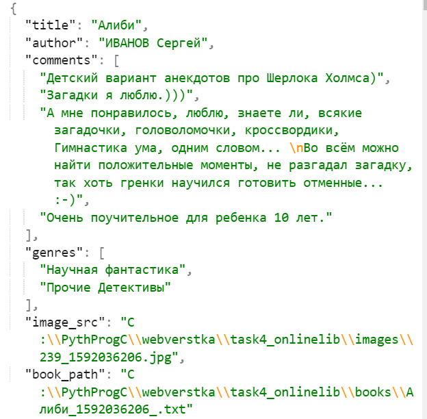

## Tululu online library

This website is an online library with the books parsed from Science fiction collection of [Tululu.org](http://tululu.org/l55/).



The library is available on [GitHub Pages](https://kmnrm.github.io/tululu-library-site/pages/index1.html).

### How to install

To have the site on your machine follow the steps below:
1. Clone or download this repository.
2. Install requirements
    ```
    $ pip install -r requirements.txt
    ```
3. Open `index1.html` or run `render_website.py`. If you use `render_website.py`, the library will be avaliable on [127.0.0.1:5500](http://127.0.0.1:5500/pages/index1.html).

4. Click on a `Читать` button next to the book's cover image to read the book. The book text will be open in a new tab.

    
    
    _Notice:_ if you run `render_website.py`, **`livereload`** will probably not interpret `.txt` files properly.
    
#### Add new books

You can parse new books using [Tululu book parser](https://github.com/kmnrm/online_library_parser).
Use **`static`** folder path in your repository as `--dest_folder` [optional parameter](https://github.com/kmnrm/online_library_parser#getting-started). 
    
The books parameters will be read from a generated `books.json`. Set repository path as your `--json_path` parameter.

```
$ python parse_tululu_catogry.py --dest_folder C:\tululu-library-site\static --json_path C:\tululu-library-site
```

This is a `books.json` file example.

